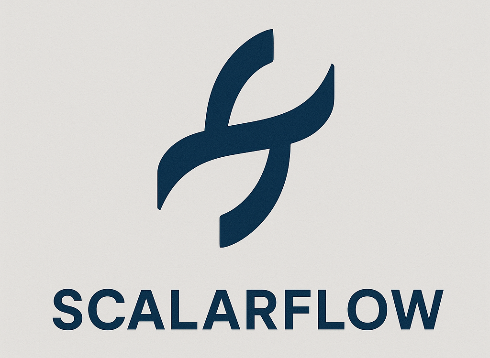

<p align="center"></p>

ScalarFlow is a pedagogical deep learning library with scalar primitives,
inspired by [micrograd] and [PyTorch].

## Development

ScalarFlow uses [uv] for dependency management. Install the library and its
dependencies with:

```bash
make install
```

ScalarFlow requires [Graphviz] for visualisation functionality. Install Graphviz
separately using your system package manager:

```bash
# macOS
brew install graphviz

# Arch Linux
pacman -Syu graphviz

# Debian/Ubuntu
apt install graphviz
```

Format with [Ruff], lint with Ruff and [basedpyright], and test with [pytest]
using:

```bash
make all
```

Run `make` to see a list of all available commands.

[basedpyright]: https://docs.basedpyright.com/
[Graphviz]: https://graphviz.org/
[micrograd]: https://github.com/karpathy/micrograd
[pytest]: https://docs.pytest.org/
[PyTorch]: https://pytorch.org
[Ruff]: https://docs.astral.sh/ruff/
[uv]: https://docs.astral.sh/uv/
